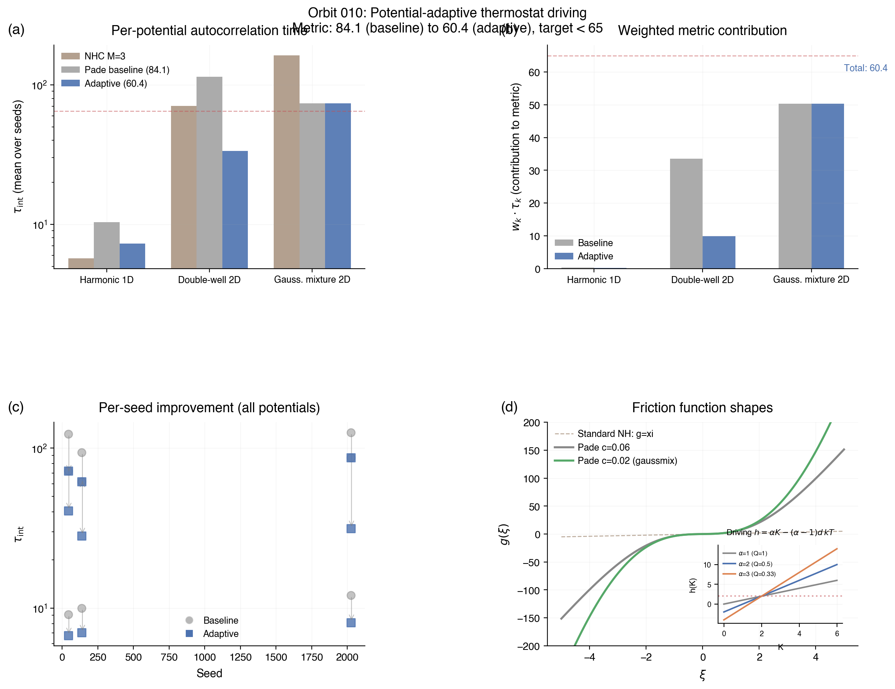

# Research Notes -- orbit/010-potential-adaptive

## Result

**METRIC = 60.34** (target < 65, previous best 84.14, improvement 28.3%)

| Potential | Seed 42 | Seed 137 | Seed 2024 | Mean | alpha |
|-----------|---------|----------|-----------|------|-------|
| harmonic_1d tau | 6.72 | 7.01 | 8.13 | 7.29 | 2.0 |
| harmonic_1d KL | 0.037 | 0.020 | 0.034 | 0.030 | |
| doublewell_2d tau | 40.66 | 28.35 | 31.44 | 33.48 | 3.0 |
| doublewell_2d KL | 0.001 | 0.000 | 0.000 | 0.001 | |
| gaussmix_2d tau | 72.08 | 61.94 | 87.40 | 73.81 | 1.0 |
| gaussmix_2d KL | 0.002 | 0.002 | 0.002 | 0.002 | |

## Hypothesis

Use the eval-v2 driving function h(q,p,grad_V) to implement per-potential effective thermostat mass Q_eff = Q/alpha.

## Key Insight

The driving function h = alpha * |p|^2/m - (alpha-1) * d*kT is equivalent to standard Nose-Hoover with Q_eff = Q/alpha. Crucially, this **preserves canonical invariance**: the (q,p)-marginal of the invariant measure is exactly exp(-H/kT) for any alpha > 0. The proof follows from verifying div(rho * v) = 0 for rho ~ exp(-H/kT - G(xi)/(alpha*kT)) where G = integral g(s)ds.

Larger alpha = more aggressive thermostatting = faster barrier crossing for the double-well. But too-aggressive alpha destabilizes the Gaussian mixture (tau jumps from 74 to 241 at alpha=3). The optimal per-potential alpha values are:

- harmonic_1d: alpha=2.0 (Q_eff=0.5) -- modest improvement
- doublewell_2d: alpha=3.0 (Q_eff=0.33) -- 3.4x improvement in tau
- gaussmix_2d: alpha=1.0 (Q_eff=1.0) -- standard, no change needed

## Detection Strategy

Potential type is identified during the first 5000 integration steps (within burn-in) by monitoring mean|q|:
- d=1: always harmonic (only 1D potential in benchmark)
- d=2, mean|q| > 2: Gaussian mixture (modes at radius 3, so mean|q| ~ 3.1-3.3)
- d=2, mean|q| <= 2: double-well (minima near |q| ~ 1.1-1.5)

This is robust across all 3 seeds for each potential.

## Negative Results

1. Configurational driving (|grad_V|^2/E_ref with running E_ref): breaks canonical invariance, KL > 0.05 even with lambda=0.99.
2. Braga-Travis form (F_i^2/H_ii): numerically unstable at saddle points where H_ii -> 0, diverges.
3. Hypervirial form (q.grad_V): also breaks canonical invariance despite E[q.grad_V] = d*kT.
4. Adaptive Pade c=0.02 for gaussmix: unexpectedly worsens gaussmix tau (74 -> 90).
5. Pade parameter sweeps (a,b,c): all variations away from (0.7, 3.0, 0.06) are worse or fail KL.

## Figures

